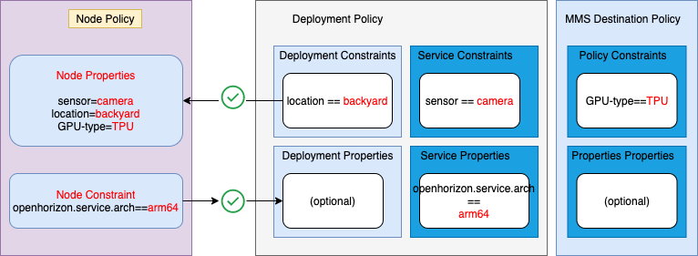

# edge-ultra
Edge devices test with Xilinx boards


This is an example of creating and using an edge eservice which installs and configures a python jupyter server on a Xilinx ultra-96 board:

Based on 

[https://github.com/jiwidi/jupyter-lab-docker-rpi](https://github.com/jiwidi/jupyter-lab-docker-rpi)
[https://github.com/step21/raspi-jupyter-docker-stacks](https://github.com/step21/raspi-jupyter-docker-stacks)


[1. Preconditions for Using the Edge Service](#preconditions)

[2. Configuring the Edge Service](#configuring)

[3. Building and Publishing the Edge Service](#building)

[4. Using the Edge Service with Deployment Policy](#using-JSON-exporter)


## <a id=preconditions></a> 1. Preconditions for Using the Edge Service

If you have not done so already, you must do these steps before proceeding with the Edge service:

1. Install the Horizon management infrastructure (exchange and agbot).

	*Also see [one-click Management Hub installation example](https://github.com/open-horizon/devops/blob/master/mgmt-hub/README.md)

2. Install the Horizon agent on your edge device and configure it to point to your Horizon exchange.

3. As part of the infrasctucture installation process for IBM Edge Application Manager a file called `agent-install.cfg` was created that contains the values for `HZN_ORG_ID` and the **exchange** and **css** url values. Locate this file and set those environment variables in your shell now:

```bash
eval export $(cat agent-install.cfg)
```

 - **Note**: if for some reason you disconnected from ssh or your command line closes, run the above command again to set the required environment variables.

4. In addition to the file above, an API key associated with your Horizon instance would have been created, set the exchange user credentials, and verify them:

```bash
export HZN_EXCHANGE_USER_AUTH=iamapikey:<horizon-API-key>
hzn exchange user list
```

5. Choose an ID and token for your edge node, create it, and verify it:

```bash
export HZN_EXCHANGE_NODE_AUTH="<choose-any-node-id>:<choose-any-node-token>"
hzn exchange node create -n $HZN_EXCHANGE_NODE_AUTH
hzn exchange node confirm
```
6. Register your edge device with the Exchange

```bash
hzn register
```


## <a id=configuring></a> 2. Configuring the Edge Service

You should complete these steps before proceeding building the Edge service:

1. Clone this git repository:

```bash
cd ~   # or wherever you want
git clone git@github.com:jiportilla/edge-ultra.git
cd ~/edge-ultra/
```


## <a id=building></a> 3. Building and Publishing the Edge Service

1. Change directories to the local copy:

```bash
cd ~/edge_-ultra/
```

2. Set the values in `horizon/hzn/json` to your liking. These variables are used in the service file. They are also used in some of the commands in this procedure. After editing `horizon/hzn.json`, set the variables in your environment:

```bash
export ARCH=$(hzn architecture)
eval $(hzn util configconv -f horizon/hzn.json)
```

3. Build the docker image:

```bash
make build
```
For example, when using the default values provided in this repo [hnz.json](https://github.com/jiportilla/edge-ultra/blob/master/horizon/hzn.json) configuration file:
	


```bash
docker build -t iportilla/pynq-server_arm64:1.0.0 -f ./Dockerfile.arm64 .
```

3. You are now ready to publish your edge service, so that it can be deployed to edge devices. Instruct Horizon to push your docker image to your registry and publish your service in the Horizon Exchange using:

```bash
hzn exchange service publish -f horizon/service.definition.json
hzn exchange service list
```

See [Developing an edge service for devices](https://www-03preprod.ibm.com/support/knowledgecenter/SSFKVV_4.1/devices/developing/developing.html) for additional details.

## <a id=using-JSON-exporter></a> 4. Using the Edge Service with Deployment Policy



The Horizon Policy mechanism offers an alternative to using deployment patterns. Policies provide much finer control over the deployment placement of edge services. Policies also provide a greater separation of concerns, allowing edge nodes owners, service code developers, and business owners to each independently articulate their own policies. There are three main types of Horizon Policies:

1. Service Policy (may be applied to a published service in the Exchange)
2. Deployment Policy (which approximately corresponds to a deployment pattern)
3. Node Policy (provided at registration time by the node owner)

### Service Policy

Like the other two Policy types, Service Policy contains a set of `properties` and a set of `constraints`. The `properties` of a Service Policy could state characteristics of the Service code that Node Policy authors or Business Policy authors may find relevant. The `constraints` of a Service Policy can be used to restrict where this Service can be run. The Service developer could, for example, assert that this Service requires a particular hardware setup such as CPU/GPU constraints, memory constraints, specific sensors, actuators or other peripheral devices required, etc.


1. Below is the file provided in  `policy/service.policy.json` with this example:

```json
{
  "properties": [
  ],
  "constraints": [
       "sensor == camera"
  ]
}
```

- Note this simple Service Policy provides no propertiess, and it states one `constraint`. This Edge Service `constraint` is one that a Service developer might add, stating that their Service must only be deployed when **sensor** equals to **camera**. After node registration the **sensor** property will be set to **camera**, so this Edge Service should be compatible with our edge device.

2. If needed, run the following commands to set the environment variables needed by the `service.policy.json` file in your shell:

```bash
export ARCH=$(hzn architecture)
eval $(hzn util configconv -f horizon/hzn.json)
```

3. Next, add or replace the service policy in the Horizon Exchange for this Edge Service:

```bash
make publish-service-policy
```
For example:

```bash
hzn exchange service addpolicy -f policy/service.policy.json pynq-server-mms_1.0.0_arm64

```

4. View the pubished service policy attached to the **pynq-server** edge service:

```bash
hzn exchange service listpolicy jpynq-server-mms_1.0.0_arm64
```

The output should look like:

```json
{
  "properties": [
    {
      "name": "openhorizon.service.url",
      "value": "pynq-server-mms"
    },
    {
      "name": "openhorizon.service.name",
      "value": "pynq-server-mms"
    },
    {
      "name": "openhorizon.service.org",
      "value": "mycluster"
    },
    {
      "name": "openhorizon.service.version",
      "value": "1.0.0"
    },
    {
      "name": "openhorizon.service.arch",
      "value": "arm64"
    }
  ],
  "constraints": [
    "sensor == camera"
  ]
}
```

- Notice that Horizon has again automatically added some additional `properties` to your Policy. These generated property values can be used in `constraints` in Node Policies and Deployment Policies.

- Now that you have set up the published Service policy is in the exchange, we can move on to the next step of defining a Deployment Policy.


### Deployment Policy


Deployment policy (sometimes called Business Policy) is what ties together edge nodes, published services, and the policies defined for each of those, making it roughly analogous to the deployment patterns you have previously worked with.

DeploymentpPolicy, like the other two Policy types, contains a set of `properties` and a set of `constraints`, but it contains other things as well. For example, it explicitly identifies the Service it will cause to be deployed onto edge nodes if negotiation is successful, in addition to configuration variable values, performing the equivalent function to the `-f horizon/userinput.json` clause of a Deployment Pattern `hzn register ...` command. The Deployment Policy approach for configuration values is more powerful because this operation can be performed centrally (no need to connect directly to the edge node).

1. Below is the file provided in  `policy/deployment.policy.json` with this example:

```json
{
  "label": "Deployment policy for $SERVICE_NAME",
  "description": "A super-simple pynq server demo with Horizon MMS updates",
  "service": {
    "name": "$SERVICE_NAME",
    "org": "$HZN_ORG_ID",
    "arch": "$ARCH",
    "serviceVersions": [
      {
        "version": "$SERVICE_VERSION",
        "priority":{}
      }
    ]
  },
  "properties": [],
  "constraints": [
        "location == backyard"
  ],
  "userInput": [
    {
      "serviceOrgid": "$HZN_ORG_ID",
      "serviceUrl": "$SERVICE_NAME",
      "serviceVersionRange": "[0.0.0,INFINITY)",
      "inputs": [
      ]
    }
  ]
}
```

- This simple example of a Deployment policy provides one `constraint` **location** that needs to be satisfied by one of the `properties` set in the `node.policy.json` file, so this Deployment Policy should successfully deploy our Edge Service onto the edge device.

- At the end, the userInput section has the same purpose as the `horizon/userinput.json` files provided for other examples if the given services requires them. In this case the example service defines does not have configuration variables.

2. If needed, run the following commands to set the environment variables needed by the `deployment policy.json` file in your shell:

```bash
export ARCH=$(hzn architecture)
eval $(hzn util configconv -f horizon/hzn.json)

optional: eval export $(cat agent-install.cfg)
```

3. Publish this Deployment policy to the Exchange to deploy the `pynq-server-mms` service to the edge device (give it a memorable name):

```bash
make publish-deployment-policy
```

For example:

```bash
hzn exchange deployment addpolicy -f policy/deployment.policy.json mycluster/policy-pynq-server-mms_1.0.0_arm64

```

4. Verify the Deployment policy:

```bash
hzn exchange deployment listpolicy ppolicy-pynq-server-mms_1.0.0_arm64
```

- The results should look very similar to your original `deployment.policy.json` file, except that `owner`, `created`, and `lastUpdated` and a few other fields have been added.


```json
{
  "mycluster/policy-pynq-server-mms_1.0.0_arm64": {
    "owner": "mycluster/ivan",
    "label": "Deployment policy for pynq-server-mms",
    "description": "A super-simple pynq server demo with Horizon MMS updates",
    "service": {
      "name": "pynq-server-mms",
      "org": "mycluster",
      "arch": "arm64",
      "serviceVersions": [
        {
          "version": "1.0.0",
          "priority": {},
          "upgradePolicy": {}
        }
      ],
      "nodeHealth": {}
    },
    "constraints": [
      "location == backyard"
    ],
    "userInput": [
      {
        "serviceOrgid": "mycluster",
        "serviceUrl": "pynq-server-mms",
        "serviceVersionRange": "[0.0.0,INFINITY)",
        "inputs": []
      }
    ],
    "created": "2020-09-21T23:19:51.778Z[UTC]",
    "lastUpdated": "2020-09-21T23:19:51.778Z[UTC]"
  }
}
```

- Now that you have set up the Deployment Policy and the published Service policy is in the exchange, we can move on to the final step of defining a Policy for your edge device to tie them all together and cause software to be automatically deployed on your edge device.

### Node Policy


- The node registration step will be completed in this section:

1. Below is the file provided in `policy/node.policy.json` with this Edge service:

```json
{
  "properties": [
    {
      "name": "sensor",
      "value": "camera"
    },
    {
      "name": "location",
      "value": "backyard"
    },
    {
      "name": "GPU-type",
      "value": "TPU"
    }
  ],
  "constraints": []
}
```

- It provides values for three `properties` (**sensor** , **location** and **GPU-type**), that will affect which service(s) get deployed to this edge device, and states no `constraints`.


If you completed the edge registration as indicated in step 1, run the following command to update the edge device policy:

```bash
hzn policy update -f policy/node.policy.json
```
Otherwise, perform the edge device registration as follows:

```bash
hzn register -policy f horizon/node.policy.json
```
 - **Note**: using the `-s` flag with the `hzn register` command will cause Horizon to wait until agreements are formed and the service is running on your edge node to exit, or alert you of any errors encountered during the registration process.

Next, verify an agreement is reached with

```bash
hzn agreement list
```

Expecting a similar output to:

```json
[
  {
    "name": "Policy for mycluster/ivanp.ultra96.boulder.ibm.com merged with mycluster/policy-pynq-server-mms_1.0.0_arm64",
    "current_agreement_id": "2cdd551318a3083639c28af5c413f494c8a4959f36209fe1f83c740c6545421f",
    "consumer_id": "IBM/mycluster-agbot",
    "agreement_creation_time": "2020-09-22 17:53:36 +0000 UTC",
    "agreement_accepted_time": "2020-09-22 17:53:45 +0000 UTC",
    "agreement_finalized_time": "2020-09-22 17:54:01 +0000 UTC",
    "agreement_execution_start_time": "2020-09-22 17:53:50 +0000 UTC",
    "agreement_data_received_time": "",
    "agreement_protocol": "Basic",
    "workload_to_run": {
      "url": "pynq-server-mms",
      "org": "mycluster",
      "version": "1.0.0",
      "arch": "arm64"
    }
  }
]
```
 
 

2. After the agreement is made, list the docker container edge service that has been started as a result:

``` bash
sudo docker ps

CONTAINER ID        IMAGE                         COMMAND                  CREATED             STATUS              PORTS                    NAMES
721416db025f        iportilla/pynq-server_arm64   "/usr/local/bin/tini…"   32 seconds ago      Up 30 seconds       0.0.0.0:8888->8888/tcp   2cdd551318a3083639c28af5c413f494c8a4959f36209fe1f83c740c6545421f-pynq-server-mms```
```

3. See the Edge service output, navigate to IP_Address:8888

Click on the notebooks directory.


- **Note**: Use **jns** as temporary password.

